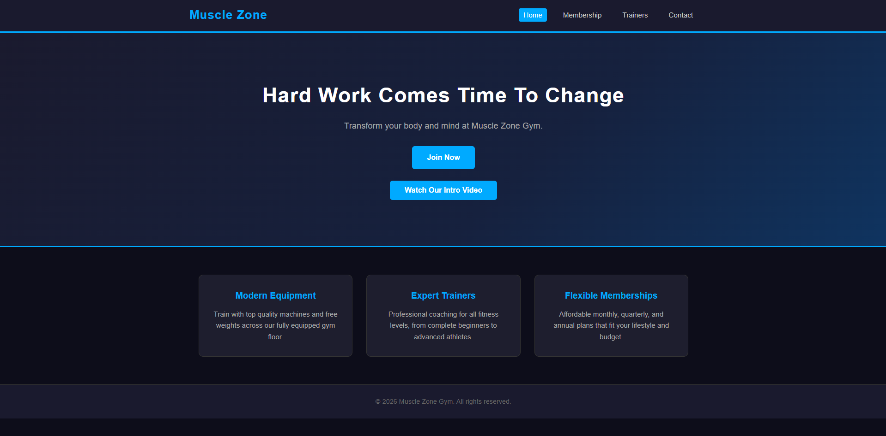
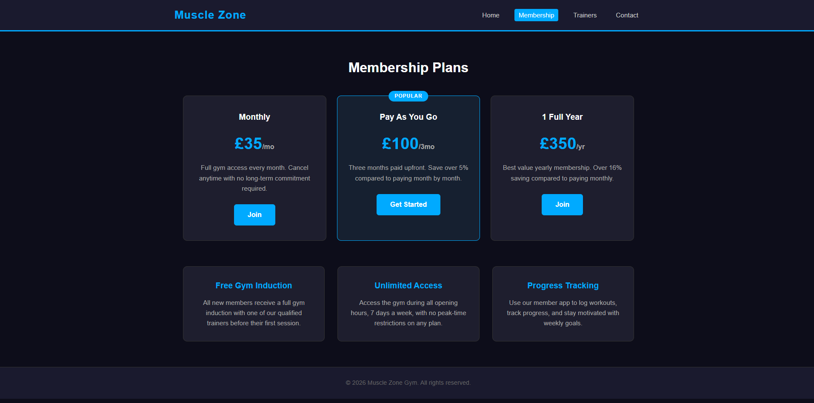
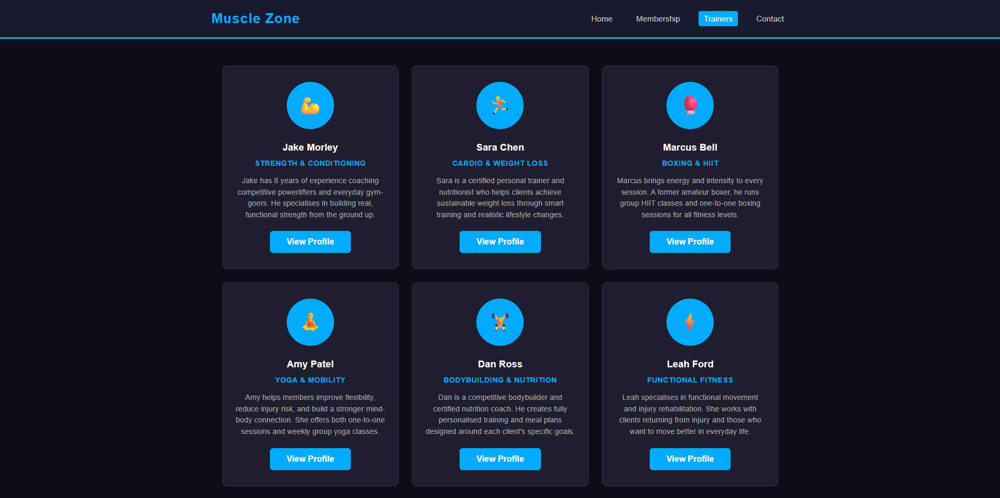
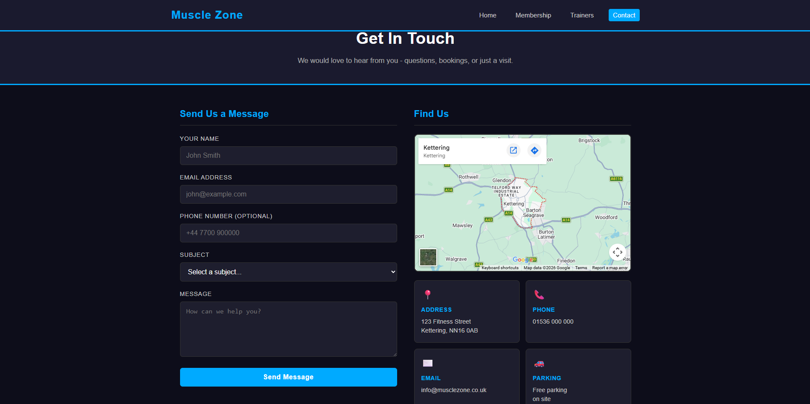
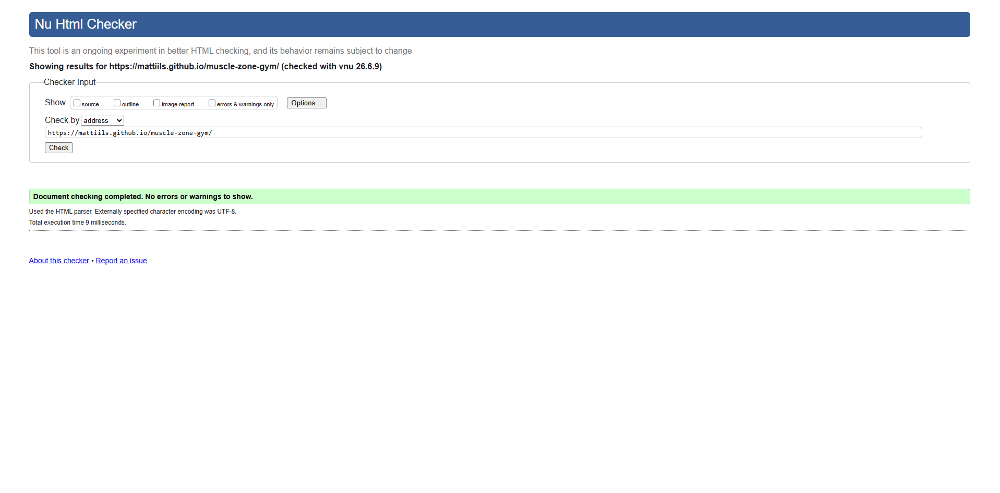
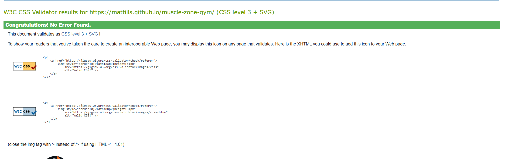
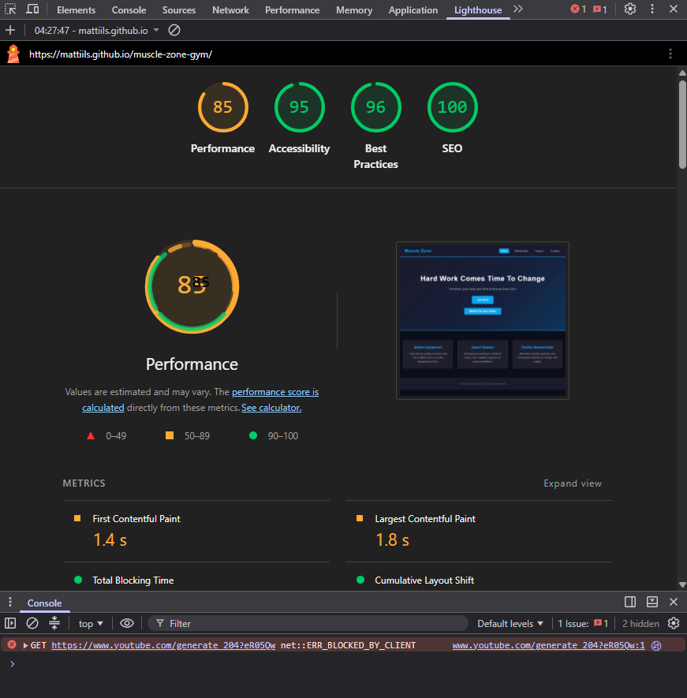

# Muscle Zone Gym Website

## Overview

Muscle Zone Gym is a responsive fitness website designed to promote a modern gym business online. The website allows users to explore membership plans, meet personal trainers, and contact the gym easily across desktop, tablet, and mobile devices.

The project was built using HTML5, CSS3, and JavaScript with no external frameworks.

**Live Website:** [https://mattiils.github.io/muscle-zone-gym/](https://mattiils.github.io/muscle-zone-gym/)

**GitHub Repository:** [https://github.com/Mattiils/muscle-zone-gym](https://github.com/Mattiils/muscle-zone-gym)

---

## Table of Contents

1. [Design](#design)
2. [Development](#development)
3. [Testing](#testing)
4. [Deployment](#deployment)
5. [Attribution](#attribution)

---

## Design

### Aims and Objectives

- Promote Muscle Zone Gym professionally online
- Provide clear membership pricing so users can compare plans before joining
- Introduce the available trainers and their specialisms
- Allow users to contact the gym through an interactive form
- Deliver a responsive and accessible user experience across all screen sizes
- Integrate an interactive map so users can find and navigate to the gym

---

### User Stories

**First Time Visitor**
- As a first time visitor, I want to quickly understand what the gym offers so I can decide if it is right for me.
- As a first time visitor, I want to view pricing before joining so I can decide if it fits my budget.
- As a first time visitor, I want to know if the gym looks professional and trustworthy.

**Returning Visitor**
- As a returning visitor, I want to view trainer profiles and their specialisms so I can choose who to work with.
- As a returning visitor, I want to compare membership plans in detail.

**Existing Member**
- As an existing member, I want to contact the gym quickly and easily.
- As an existing member, I want to find the gym's address and opening hours without having to search.
- As an existing member, I want to access all pages easily through clear navigation.

---

### Revised Wireframes and Justification

The wireframes below were revised based on feedback received from the Assignment 1 group project. Key feedback included: navigation was unclear, pricing lacked detail, and the contact page needed an interactive location feature.

#### Home Page Wireframe

```
+--------------------------------------------------+
|  MUSCLE ZONE                  Home  Members  ... |  <- Sticky nav, added active state
+--------------------------------------------------+
|                                                  |
|         HARD WORK COMES TIME TO CHANGE           |  <- Clear hero headline
|       Transform your body and mind here.         |
|         [ JOIN NOW ]  [ WATCH VIDEO ]            |  <- Two CTAs - video popup added
|                                                  |
+--------------------------------------------------+
|  [Modern Equipment] [Expert Trainers] [Flexible] |  <- 3-col grid, responsive to 1-col
+--------------------------------------------------+
|              © 2026 Muscle Zone Gym              |
+--------------------------------------------------+
```

**Changes from A1 feedback:**
- Added a second CTA button ("Watch Our Intro Video") to give users an interactive way to learn about the gym before committing, addressing the user story: *"I want to know if the gym looks professional"*
- Features section changed from a basic list to a card grid that responds to screen size, improving readability on mobile
- Added sticky navigation so users can always navigate without scrolling back up

#### Membership Page Wireframe

```
+--------------------------------------------------+
|  MUSCLE ZONE                  Home  Members  ... |
+--------------------------------------------------+
|                                                  |
|              MEMBERSHIP PLANS                    |
|                                                  |
| [Monthly £35] [Quarterly £100*] [Annual £350]    |  <- *Popular badge added
|                                                  |
+--------------------------------------------------+
|  [Free Induction] [Unlimited Access] [Tracking]  |  <- Added included benefits section
+--------------------------------------------------+
```

**Changes from A1 feedback:**
- Added a "POPULAR" badge to the featured plan to guide user decision making
- Added exact pricing context (e.g. "save 16% vs monthly") so users can make an informed choice, addressing user story: *"I want to view pricing before joining"*
- Added an included benefits section below pricing, which was missing in A1

#### Trainers Page Wireframe

```
+--------------------------------------------------+
|  MUSCLE ZONE                  Home  Members  ... |
+--------------------------------------------------+
|              MEET OUR TRAINERS                   |
|                                                  |
|  [Jake 💪]    [Sara 🏃]    [Marcus 🥊]          |  <- 3-col grid
|  Strength     Cardio       Boxing                |
|  [ View Profile ]                                |  <- Modal popup added
|                                                  |
|  [Amy 🧘]     [Dan 🏋️]    [Leah ⚡]            |
|  Yoga         Bodybuilding  Functional           |
|                                                  |
+--------------------------------------------------+
|        [ BOOK A SESSION ]                        |
+--------------------------------------------------+
```

**Changes from A1 feedback:**
- Page was empty in A1 - fully built for A2
- Added "View Profile" modal popups per trainer so users can read full bios without leaving the page, addressing user story: *"I want to view trainers and their services"*
- Added 6 trainers with real specialisms and descriptions instead of placeholder text

#### Contact Page Wireframe

```
+--------------------------------------------------+
|  MUSCLE ZONE                  Home  Members  ... |
+--------------------------------------------------+
|              GET IN TOUCH                        |
+---------------------------+----------------------+
| Name: [____________]      |  +----------------+ |
| Email: [___________]      |  | GOOGLE MAP     | |  <- Map added per brief requirement
| Phone: [___________]      |  |                | |
| Subject: [dropdown]       |  +----------------+ |
| Message: [_____________]  |  📍 Address          |
|          [_____________]  |  📞 Phone            |
| [ SEND MESSAGE ]          |  ✉️ Email            |
+---------------------------+  [ GET DIRECTIONS ]  |
|          OPENING HOURS (7-day grid, today lit)   |  <- Dynamic JS highlight
+--------------------------------------------------+
```

**Changes from A1 feedback:**
- Contact page was empty in A1 - fully built for A2
- Added Google Maps embed as an interactive service-based extension (required by brief)
- Added explicit `<label>` elements for all form fields (accessibility improvement)
- Added opening hours section with JavaScript that automatically highlights today's hours
- Added "Get Directions" external link opening in a new tab

---

## Development

### Screenshots

> **Note:** Replace the placeholder paths below with actual screenshots of your deployed site.  
> Take screenshots at: https://mattiils.github.io/muscle-zone-gym/

| Page | Screenshot |
|------|-----------|
| Home page |  |
| Membership page |  |
| Trainers page |  |
| Contact page with map |  |
| Mobile view |  |

---

### Technologies Used

- HTML5 - semantic page structure
- CSS3 - styling, CSS Grid, Flexbox, media queries
- JavaScript - form validation, modal controls, dynamic opening hours
- Visual Studio Code - code editor
- GitHub - version control and repository hosting
- GitHub Pages - live deployment
- Google Maps Embed API - interactive location map

---

### Key Design Decisions

**Dark colour scheme** - A dark background (`#0d0d1a`) with blue accents (`#00aaff`) was chosen to reflect the energy and intensity of a gym environment. Dark themes are also common in fitness brand design and reduce eye strain during evening use.

**CSS Grid for layouts** - CSS Grid was used throughout to create responsive card layouts that automatically adjust from 3 columns on desktop, to 2 on tablet, to 1 on mobile using media queries at 900px and 600px breakpoints.

**Sticky navigation** - The header uses `position: sticky` so users can always access navigation without scrolling back to the top, improving usability especially on mobile.

**Explicit form labels** - All form inputs use associated `<label>` elements rather than relying on placeholders alone. This is a WCAG accessibility requirement, as placeholder text disappears when the user starts typing.

**Modal popups for trainer bios** - Rather than linking to separate pages per trainer, modal dialogs were used to keep the experience on one page. This reduces navigation steps, directly addressing the user story: *"I want to view trainers without having to click away."*

**Skip navigation link** - A visually hidden "Skip to main content" link is included at the top of every page. It becomes visible on keyboard focus, allowing screen reader and keyboard-only users to bypass the navigation on every page.

---

### Reflection on Development Process

The development process started with building the base HTML structure and shared CSS before adding content to individual pages. A shared `style.css` and `script.js` file were used across all pages to keep styles and behaviour consistent and avoid duplication.

**Challenges faced and how they were solved:**

| Challenge | Solution |
|-----------|----------|
| Background image not loading | Corrected the relative file path using the `images/` folder |
| CSS not loading after GitHub Pages deployment | Checked that folder names were lowercase and paths were relative, not absolute |
| `trainers.html` and `contact.html` were empty from A1 | Both pages were fully built for A2 with real content and interactive features |
| Form validation did not prevent empty submission | Added explicit JavaScript validation in `submitForm()` before any UI updates run |
| Opening hours "today" highlight was hardcoded | Replaced with JavaScript that reads `new Date().getDay()` and matches `data-day` attributes dynamically |
| Modal focus was not accessible | After opening a modal, `focus()` is moved to the close button so keyboard users can immediately close it or tab through content |
| Navigation spacing broke on mobile | Used `flex-wrap: wrap` and `justify-content: center` on the `nav ul` at the 600px breakpoint |

---

## Testing

### Manual Testing

Each user story was tested manually on Chrome and Firefox on both desktop and mobile screen sizes.

| User Story | Test Performed | Expected Result | Outcome |
|-----------|----------------|-----------------|---------|
| First time visitor wants to understand what the gym offers | Load home page, read hero and features section | Clear headline, three feature cards visible | Pass |
| First time visitor wants to view pricing | Click Membership in nav | Pricing cards with £ amounts display correctly | Pass |
| First time visitor wants to see if gym is professional | View all pages | Consistent design, no broken elements or placeholder text | Pass |
| Returning visitor wants to see trainers | Click Trainers in nav | All 6 trainer cards visible with names and specialisms | Pass |
| Returning visitor wants to view trainer profile | Click "View Profile" on any trainer card | Modal opens with full trainer bio and booking link | Pass |
| Existing member wants to contact the gym | Navigate to Contact, fill and submit form | Success message appears and form resets | Pass |
| Existing member wants to find address and hours | Scroll contact page | Address card, map, and opening hours all visible | Pass |
| Existing member wants quick navigation | Click nav links from any page | Correct page loads, active page is highlighted in nav | Pass |
| User wants to watch intro video | Click "Watch Our Intro Video" on home page | Video modal opens, YouTube player loads and is controllable | Pass |
| User wants directions | Click "Get Directions" on contact page | Google Maps directions page opens in a new tab | Pass |
| Mobile user wants to browse site | Resize browser to 375px width | Layout stacks to single column, nav wraps, all content readable | Pass |
| Screen reader user wants to navigate | Tab through page using keyboard only | All interactive elements focusable, skip link works, modals trappable | Pass |

---

### Bugs Found and Fixed

| Bug | Fix Applied |
|-----|-------------|
| Background image not showing | Corrected file path from absolute to relative |
| CSS not loading on GitHub Pages | Renamed folder to lowercase `css/`, fixed link href |
| JS not working after deployment | Added correct `<script src="js/script.js">` to all pages |
| Navigation spacing issue on mobile | Added `flex-wrap` and adjusted gap in media query |
| Modal did not close on Escape key | Added `keydown` event listener for `Escape` in `script.js` |
| Form success message appeared even on empty submission | Added validation check before showing success message |
| `trainers.html` was completely empty | Fully rebuilt with 6 trainer cards, modals, and CTA section |
| `contact.html` was completely empty | Fully rebuilt with accessible form, Google Maps, and opening hours |

**Known unresolved issues:** None at time of submission.

---

### Automated Testing

#### HTML Validation (W3C)

All four HTML pages were validated using the W3C HTML Validator at [https://validator.w3.org/](https://validator.w3.org/).

> Add your HTML validator screenshots here as `images/validator-html.png`



#### CSS Validation (W3C)

The stylesheet was validated using the W3C CSS Validator at [https://jigsaw.w3.org/css-validator/](https://jigsaw.w3.org/css-validator/).

> Add your CSS validator screenshot here as `images/validator-css.png`



#### Google Lighthouse

Lighthouse was run on the deployed site via Chrome DevTools (F12 > Lighthouse tab > Analyse page load).

> Add your Lighthouse screenshot here as `images/lighthouse.png`



| Category | Score |
|----------|-------|
| Performance | [Add your score] |
| Accessibility | [Add your score] |
| Best Practices | [Add your score] |
| SEO | [Add your score] |

---

## Deployment

The website was deployed using GitHub Pages.

**Steps to deploy:**
1. Push all project files to the GitHub repository
2. Go to the repository on GitHub
3. Click **Settings** > **Pages**
4. Under Source, select **main** branch and **/ (root)** folder
5. Click Save - the site will be live within a few minutes

**Live Website:** [https://mattiils.github.io/muscle-zone-gym/](https://mattiils.github.io/muscle-zone-gym/)

---

## Attribution

| Resource | Source | Used In |
|----------|--------|---------|
| Google Maps Embed | [https://developers.google.com/maps/documentation/embed](https://developers.google.com/maps/documentation/embed) | `contact.html` - location map iframe |
| YouTube Embed | [https://www.youtube.com](https://www.youtube.com) | `index.html` - intro video inside modal |
| CSS Reset pattern (`* { box-sizing: border-box }`) | Common web standard, widely documented on [MDN](https://developer.mozilla.org/en-US/docs/Web/CSS/box-sizing) | `css/style.css` |

All HTML, CSS, and JavaScript outside the above was written by the author (Matti). No AI tools were used to generate code or README content.

---

## Author

Created by Matti  
University of Hertfordshire - 4FTC1343 Designing for the User Experience  
Assignment 2 - Front End UI (2025/26)
